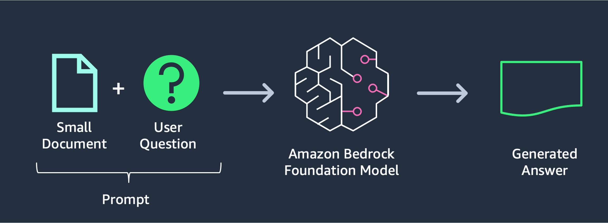

## Technical Guide: Stock-Assistant with Amazon Bedrock and Claude 3 Sonnet Model

### Overview: Stock-Assistant
The **Stock-Assistant** demo leverages **Amazon Bedrock** and **Anthropic's Claude 3 Sonnet Model** using **Langchain** and **Streamlit**. This project demonstrates how to integrate and deploy an AI-driven assistant that interacts with stock-related data.

For more details, please refer to the official documentation:
- [Amazon Bedrock](https://aws.amazon.com/bedrock/)
- [Claude 3](https://www.anthropic.com/news/claude-3-family)

### Setup Instructions

#### 1. Install Python
Follow the official guide to set up Python for your environment:
- [Python Installation Guide](https://docs.python-guide.org/starting/install3/linux/)

#### 2. Set Up a Python Virtual Environment
Create a Python virtual environment to isolate the project dependencies:
- [Setting Up a Python Environment](https://docs.python-guide.org/starting/install3/linux/)

#### 3. Install AWS CLI
To interact with AWS services like Amazon Bedrock, install and configure AWS CLI:
- [AWS CLI Quickstart Guide](https://docs.aws.amazon.com/cli/latest/userguide/getting-started-quickstart.html)

#### 4. Clone and Run the Stock-Assistant

```bash
# Clone the repository
git clone https://github.com/your-repo/stock-assistant.git

# Pull the latest changes
git pull

# Change to the project directory
cd stock-assistant

# Install all dependencies from the requirements file
pip3 install -r requirements.txt

# Run the application using Streamlit
streamlit run Home.py --server.port 8501
```

You can access the running app via your web browser at `http://localhost:8501`.

---

### Architecture

The Stock-Assistant is built on a modular architecture that incorporates the following components:
- **Amazon Bedrock** as the foundational model-serving platform.
- **Claude 3 Sonnet** from Anthropic for natural language processing.
- **Langchain** for seamless AI and application integration.
- **Streamlit** for the user-friendly interface.



---

### Learn More About Prompts and Claude 3

- [Introduction to Prompt Design](https://docs.anthropic.com/claude/docs/introduction-to-prompt-design)
- [Claude 3 Model Card](https://www-cdn.anthropic.com/de8ba9b01c9ab7cbabf5c33b80b7bbc618857627/Model_Card_Claude_3.pdf)

---

### Docker Setup

If you prefer running the application using Docker, follow these steps:

```bash
# Pull the latest changes from the repository
git pull

# Use Docker Compose to start the application in detached mode
docker compose up -d
```

---

### Environment Configuration

Create a `.env` file in the project root to store environment variables required for AWS access:

```
AWS_DEFAULT_REGION=us-east-1
AWS_ACCESS_KEY_ID=your_access_key
AWS_SECRET_ACCESS_KEY=your_secret_key
```

Make sure to replace `your_access_key` and `your_secret_key` with your actual AWS credentials. This ensures proper authentication with Amazon Bedrock and other AWS services.

---

